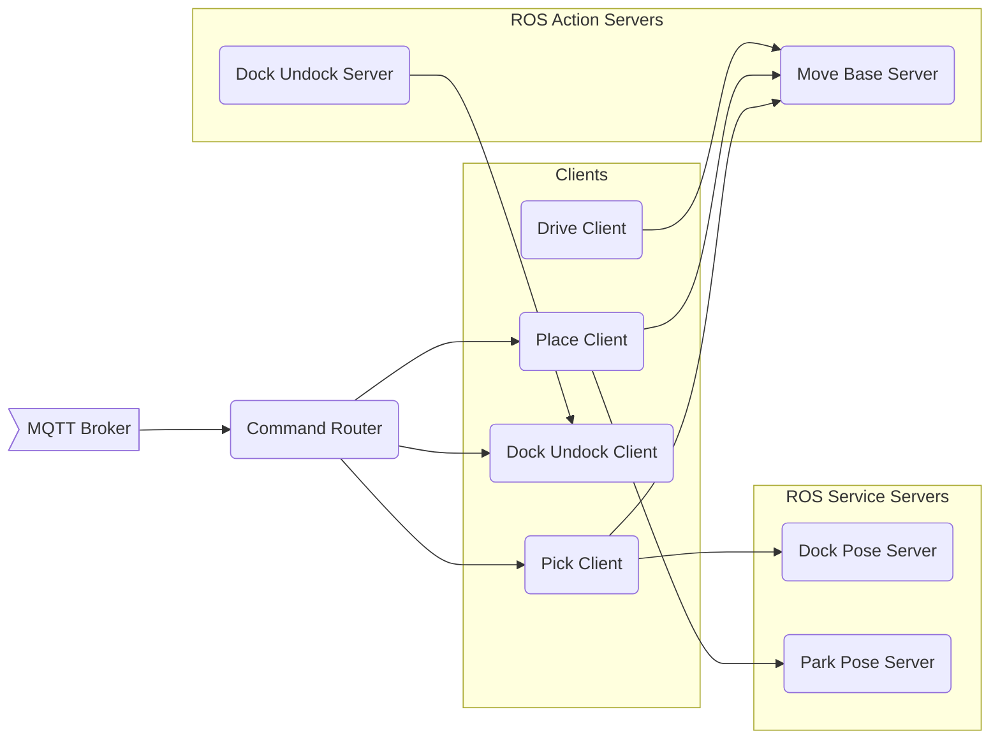

# FMS ROB
A fleet management API for the ROBOTNIK rb1_base robots.  

## Architecture


## Usage
To interface with the API, the user sends messages via MQTT in JSON format.

MQTT Topics used:
```
/robotnik/mqtt_ros_command  
/robotnik/mqtt_ros_info
```

MQTT Settings:
```
Broker: gopher.phynetlab.com  
Port: 8888
```

Message structure:
```
```

Sample Message:
```
```

To interface **directly** with the action clients, the following topics can be used:
```
```

To request actions, the *RobActionSelect* custom message is to be used. The message structure is as follows:
```
Header header  
geometry_msgs/Pose goal  
string command_id  
string cart_id  
string station_id  
string bound_mode  
string action  
time cancellation_stamp  
```
To receive status info, the *RobActionStatus* custom message is to be used. The message structure is as follows:
```
Header header  
string command_id  
string cart_id  
string station_id  
string bound_mode  
string action  
uint8 status  
```


Possible actions:

* **Pick**: Navigates the robot to a calculated location infront of the requested cart
* **Dock**: Performs the actual docking operation with the cart, which consists of:
  
* **Undock**: Performs the undocking operation which consists of:
* **Place**: Places the cart near one of the stations in one of 3 locations (*bound mode*): *inbound*, *outbound*, or *queue*
* **Drive**: Navigates the robot to a pose spectified by the user

## Bash Commands
```
killA, killB,..., killAll
```

## Roadmap
* Adding interlocks
* Adding *home* & *return* actions

## Future Work
* Implement a SMACH state machine architecture to replace contain current architecture
* Use *move_base_flex (mbf)* action server for robots' navigation

