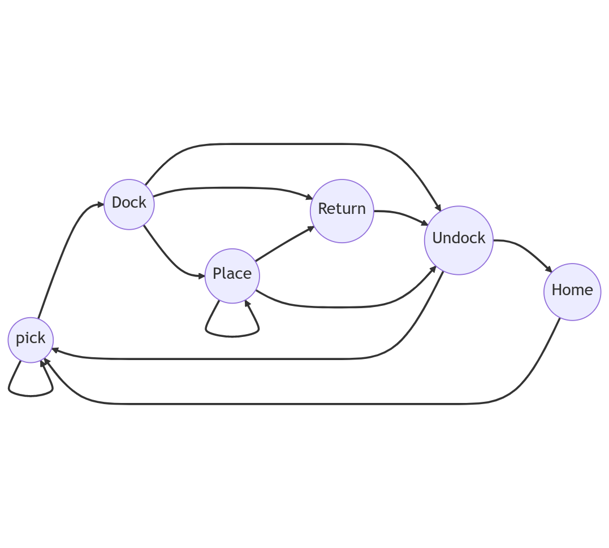

# **FMS ROB**

A robot management API that handles the interface between the fleet management system and the lower level operations on the ROBOTNIK rb1_base robots. The entire implementation runs on the robots' side.

## **Architecture**


## **Usage**


To interface with the API, the user sends or receives messages via MQTT in JSON format.

### **MQTT Topics used:**

For sending commands and receiving status info from the API.
```
/robotnik/mqtt_ros_command  
/robotnik/mqtt_ros_info
```

### **MQTT Settings:**

```
Broker: gopher.phynetlab.com  
Port: 8888
```

### **MQTT Message Structure:**

**robot_id**: string (rb1_base_a, rb1_base_b, etc)  
**command_id**: string (used for synching status messages)  
**pose** (translation(x,y,z), rotation(x,y,z,w)) : int struct (used only in the drive action (see below))  
**action**: string (see below)  
**cart_id**: string (cart to picked or returned)  
**stataion_id**: string (station to park robot beside)  
**bound_mode**: string (parking location with respect to station. Check place action below)  
**cancellation_stamp**: float (check cancelAtAndBefore command below)  


### **Sample MQTT Message:**

```
{
"robot_id": "rb1_base_b",
"command_id": "task123",
"pose": {
"position": {
"x": 0,
"y": 0,
"z": 0
},
"orientation": {
"x": 0,
"y": 0,
"z": 0,
"w": 1
}},
"action": "pick",
"cart_id": "KLT_6_neu",
"station_id": "AS_5_neu",
"bound_mode": "inbound",
"cancellation_stamp": 1571949975.18291
}
```

*Note*: To send MQTT commands, simple apps can be used such as MQTTLens on Google Chrome (https://chrome.google.com/webstore/detail/mqttlens/hemojaaeigabkbcookmlgmdigohjobjm?hl=en)

### **Possible actions:**

* **pick**: Navigates the robot to a calculated location infront of the requested cart
* **dock**: Performs the actual docking operation with the cart, which consists of: 1) auxillary motion to correct pose error by the local planner, 2) motion under cart, 3) elevator raise, 4) 180<sup>o</sup> rotaion
  
* **undock**: Performs the undocking operation which consists of: 1) elevator drop, 2) 180<sup>o</sup> rotaion, 3) motion out from under cart
* **place**: Places the cart near one of the stations in one of 3 locations (*bound mode*): *inbound*, *outbound*, or *queue*
* **drive**: Navigates the robot to a pose spectified by the user
* **return**: return the cart to its pick up position
* **home**: sends robot to its predefined home position
* **cancelCurrent**: cancels currently active goal (task)
* **cancelAll**: cancels all goals (tasks) in the queue of the action server
* **cancelAtAndBefore**: cancel all goals (tasks) at and before a time stamp (cancellation_stamp) specified by the user

## **Behavior**




Interlock system enables/dsiabels the specific actions that the robot can execte

## **Further Notes**


To interface **directly** with the action clients, custom ROS messages (namely: *RobActionSelect* & *RobActionStatus*) can be published or received on the following topics:

```
/ROBOT_ID/rob_action
/ROBOT_ID/rob_action_status
```

where ROBOT_ID is replaced by *rb1_base_a*, *rb1_base_b*, etc.  
 

To request actions, the *RobActionSelect* custom ROS message is to be used. The message structure is as follows:

```
Header header  
geometry_msgs/Pose goal  
string command_id  
string cart_id  
string station_id  
string bound_mode  
string action  
time cancellation_stamp  
```

To receive status info, the *RobActionStatus* custom ROS message is to be used. The message structure is as follows:

```
Header header  
string command_id  
string cart_id  
string station_id  
string bound_mode  
string action  
uint8 status  
```

## **Dynamic Reconfiguration**


The current interlocks system and the return pose can be modified during runtime using the dynamic reconfigure server. 

*Note*: Please export (on the main PC) the ros master uri of the robot of interest before using this feature. For robot B, for ex, the following commands can be used:
```
export ROS_MASTER_URI=http://192.168.0.202:11311
rosrun rqt_reconfigure rqt_reconfigure 
```

## **Bash Commands**


Shell commands to stop the robots immedietly (implemented locally in *bashrc*)

```
killA, killB,..., killAll
```

## **Disclaimer**


The package assumes that the robots' position is known through an external source, i.e: a motion capture system. In the robot setup available, the integration of the motion capture data into ROS is provided through the ros_mocap package.  
A possible solution to use the API without motion capture is to publish some pose data for the robots, carts, and stations of interest on their respective vicon topics directly. Data from actual robot runs can be provided via ROS bags.

## **Roadmap**


* ~~Adding interlocks for fail-safe operation~~
* ~~Adding *home* & *return* actions~~
* ~~Testing preemtive requests~~
* Implement trajecotry Sharing between robots for dynamic obstacles avoidance

## **Future Work**


* Implement a SMACH state machine architecture to replace / contain current architecture
* Use *move_base_flex (mbf)* action server for robots' navigation


