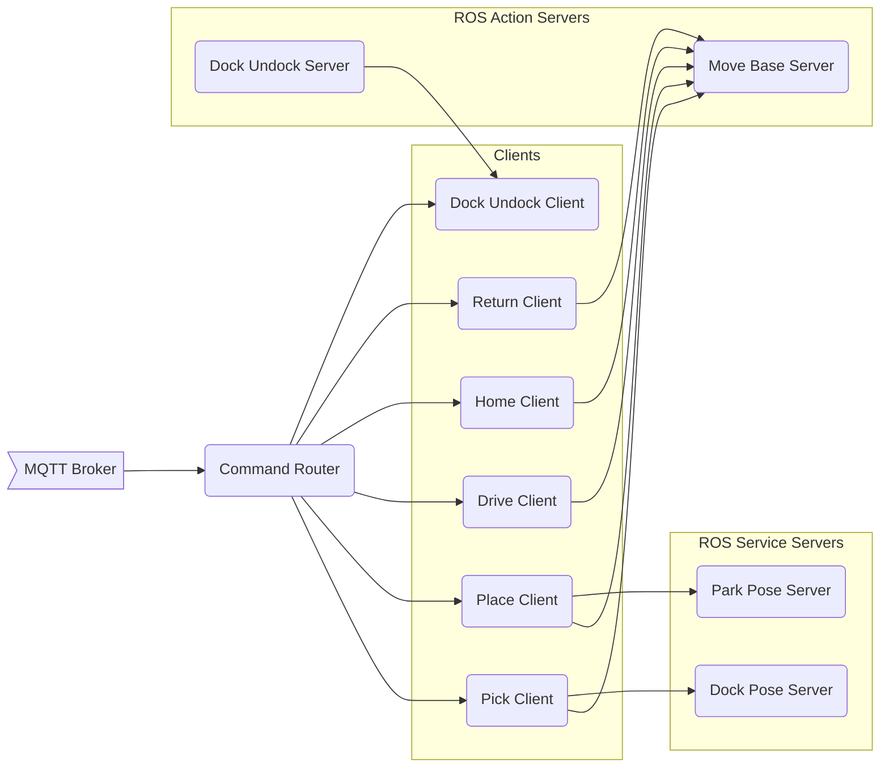

```mermaid
graph LR;
  broker>MQTT Broker]-->router(Command Router);
  router-->pick(Pick Client);
  pick-->move(Move Base Server);
  router-->place(Place Client);
  place-->move;
  drive(Drive Client)-->move;
  router-->drive
  dock_se(Dock Undock Server)-->dock_cl;
  router-->home(Home Client);
  router-->return(Return Client);
  pick-->dock_po(Dock Pose Server);
  place-->park(Park Pose Server);
  router-->dock_cl(Dock Undock Client);
  return-->move;
  home-->move;
  %%dynam(dynamic reconf)-->pick;
  %%dynam-->place;
  %%dynam-->return;
  %%dynam-->home;
  %%dynam-->dock_cl;
  %%dock_se-->dynam;
  subgraph Clients
  pick
  place
  drive
  home
  return
  dock_cl
  end
  subgraph ROS Service Servers
  dock_po
  park
  end
  subgraph ROS Action Servers
  dock_se
  move
  end
  %%subgraph Dynamic Reconfigure Server
  %%dynam
  %%end


```
