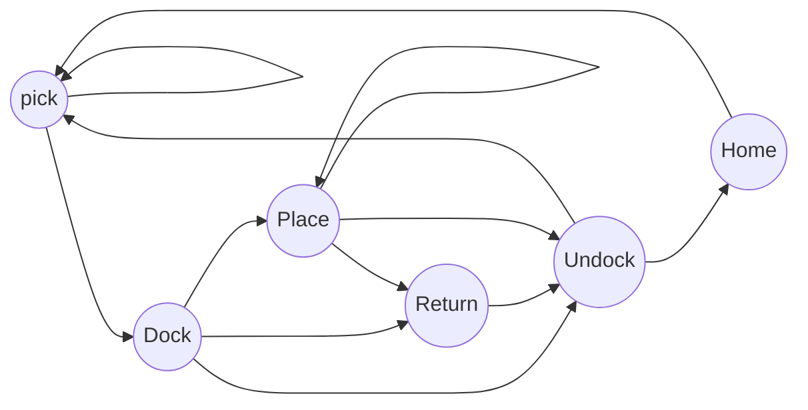

```mermaid
graph LR;
  pick((pick))-->dock((Dock))
  dock-->return((Return))
  dock-->undock((Undock))
  return-->undock((Undock))
  undock-->home((Home))
  dock-->place((Place))
  place-->return
  place-->place
  place-->undock((Undock))
  pick-->pick
  undock-->pick
  home-->pick
```
